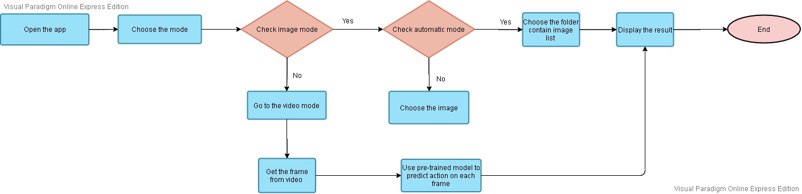

# Intelligent System Assignment
The repository for Intelligent System class in Ho Chi Minh University of Technology

## Group Member
Group 6 includes three members:
1. Nguyen Anh Hoang Phuc 1752041
2. Truong Minh Duy 1652113
3. Tran Trung Quan 1752044

## Brief description
Our goal is to design an autonomous image-driven detecting system 
to spot distracted drivers inspired by this [competition](https://www.kaggle.com/c/state-farm-distracted-driver-detection). 
Please refer slide and report in folder report for more details. 

The flow chart of our mini system is described in the below image:

## Reference
Please refer to the **Reference part** in the report